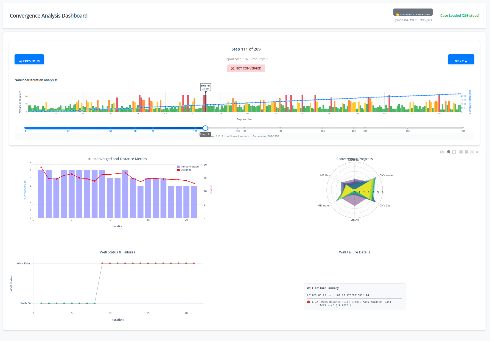

# OPM Convergence Analysis

A Python library for analyzing convergence behavior in OPM Flow reservoir simulations.

## Overview

This package provides tools for analyzing convergence behavior from OPM Flow simulation data, particularly from INFOITER files. It focuses on core convergence analysis functionality including error metric calculation, convergence indicators, and interactive visualization.

## Features

- **Data Reading**: Parse INFOITER files from OPM Flow simulations
- **Convergence Analysis**: Calculate error metrics and convergence indicators
- **Visualization**: Create interactive plots and dashboards for convergence analysis

## Interactive Dashboard

<div align="center">
  
  <p><em>Interactive dashboard showing convergence analysis with nonlinear iteration tracking, error metrics, convergence progress visualization, and well failure analysis</em></p>
</div>

## Installation

```bash
git clone https://github.com/opm/opm-convergence-analysis.git
cd opm-convergence-analysis

# Create and activate virtual environment
python -m venv venv
source venv/bin/activate  # On Windows: venv\Scripts\activate

# Install the package
pip install -e .
```

## Usage

### Generate INFOITER File from OPM Flow

To use this tool, you need to run your OPM Flow simulation with extra convergence information:

```bash
flow SIMULATION_DECK.DATA --output-extra-convergence-info="steps,iterations"
```

This will generate a `SIMULATION_DECK.INFOITER` file containing the convergence data needed for analysis.

### Start the Dashboard
```bash
source venv/bin/activate  # On Windows: venv\Scripts\activate
python app.py
```
Opens web interface at `http://localhost:8050` for uploading files.

### Run with Data
```bash
# Test with included Norne case
python app.py --case src/opm_convergence_analysis/tests/reference_data/NORNE_ATW2013.INFOITER

# Run with your own files
python app.py --case /path/to/your/simulation.INFOITER
python app.py --case /path/to/your/simulation.DBG
```

### Python API
```python
import opm_convergence_analysis as oca

# Simple one-liner: analyze and save dashboard
errors, labels, metrics, fig = oca.analyze_and_plot("simulation.INFOITER")

# Or step-by-step with custom options
data = oca.load_infoiter("simulation.INFOITER")
errors, labels, metrics = oca.analyze_convergence(data)
fig = oca.plot_convergence_analysis(data, errors, labels, metrics, save_path="results.html")
```

## Main Components

- **DataReader**: Parse INFOITER files from OPM Flow simulations
- **Analyzer**: Calculate error metrics and convergence indicators
- **Visualization**: Plot convergence analysis results with interactive capabilities

## API Reference

### High-level Functions

- `load_infoiter(filename)`: Load INFOITER file and return parsed data
- `analyze_convergence(data, **kwargs)`: Analyze convergence behavior from data
- `plot_convergence_analysis(data, errors, labels, metrics, **kwargs)`: Create interactive dashboard
- `analyze_and_plot(infoiter_file, output_file=None, **kwargs)`: One-liner to analyze and save dashboard

## Development

Run tests: `pytest src/opm_convergence_analysis/tests/`
Format code: `black src/ && flake8 src/`