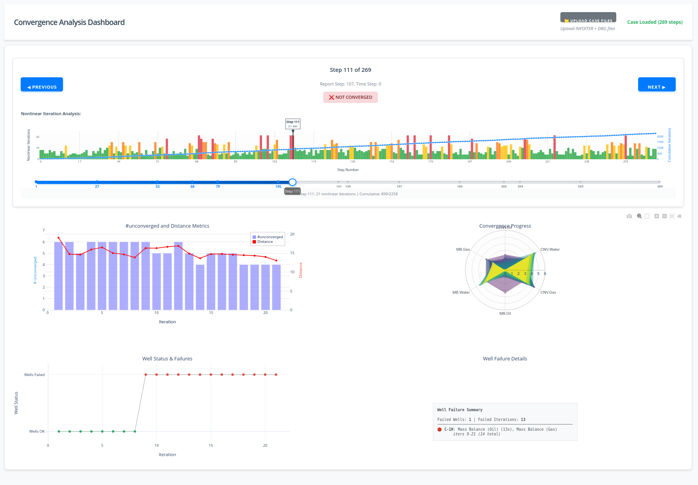

# Reservoir Simulation Convergence Analysis

A Python library for analyzing convergence behavior in reservoir simulations.

## Overview

This package provides tools for analyzing convergence behavior from reservoir simulation data. It focuses on core convergence analysis functionality including error metric calculation, convergence indicators, and interactive visualization.

## Features

- **Generic Data Model**: Simulator-agnostic data structure for convergence logs.
- **Multi-Simulator Support**:
    - **OPM Flow**: Built-in support for INFOITER/DBG files.
    - **Extensible**: Easy to add support for Eclipse, Intersect, JutulDarcy, etc. via custom Readers.
- **Convergence Analysis**: Calculate error metrics and convergence indicators.
- **Visualization**: Create interactive plots and dashboards for convergence analysis.

## Interactive Dashboard

<div align="center">
  
  <p><em>Interactive dashboard showing convergence analysis with nonlinear iteration tracking, error metrics, convergence progress visualization, and well failure analysis</em></p>
</div>

## Installation

```bash
git clone https://github.com/opm/opm-convergence-analysis.git
cd opm-convergence-analysis

# Create and activate virtual environment
python -m venv venv
source venv/bin/activate  # On Windows: venv\Scripts\activate

# Install the package
pip install -e .
```

## Usage

### Start the Dashboard
```bash
source venv/bin/activate  # On Windows: venv\Scripts\activate
python app.py
```
Opens web interface at `http://localhost:8050` for uploading files.

### Run with Data
```bash
# Test with included Norne case (OPM Flow format)
python app.py --case src/opm_convergence_analysis/tests/reference_data/NORNE_ATW2013.INFOITER

# Run with your own files (auto-detected format)
python app.py --case /path/to/your/simulation_output
```

### OPM Flow Specifics

To use this tool with OPM Flow, run your simulation with extra convergence information:
```bash
flow SIMULATION_DECK.DATA --output-extra-convergence-info="steps,iterations"
```
This generates the `.INFOITER` file.

## Generic Simulator Support

This library is designed to be simulator-agnostic.

For detailed information on the data format and how to add support for new simulators, see [Input Requirements](docs/input_requirements.md).

## Main Components

- **BaseReader/SimulationData**: Generic data interface (`core`).
- **Simulators**:
    - **OPM Flow**: Full support (INFOITER/DBG).
    - **Custom**: Implement `BaseReader` to support others.
- **Analyzer**: Calculate error metrics and convergence indicators.
- **Visualization**: Plot convergence analysis results with interactive capabilities.

## Development

Run tests: `pytest src/opm_convergence_analysis/tests/`
Format code: `black src/ && flake8 src/`
